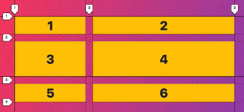

# CSS Grid

I learned CSS Grid through a course that Wes Bos teaches: [cssgrid.io](cssgrid.io). Please visit his site and support his work. He's an awesome teacher and web developer! 🔥

Most of my images are all obtained from his course's online repository, hosted on GitHub which you can access [here](https://github.com/wesbos/css-grid).

---

## What Is It

CSS Grid is the latest feature in CSS, allowing developers to create responsive and non-responsive grid-like elements on a webpage.

The columns and rows in a grid are collectively referred to as `tracks`.

The best tool to use to analyze CSS Grid is **Firefox Developer Edition**.

---

## Setting Up

```html
<div class="container">
  <div class="item">1</div>
  <div class="item">2</div>
  <div class="item">3</div>
  <div class="item">4</div>
</div>
```

```css
.container {
  display: grid;
  grid-template-columns: 100px 100px 100px;
  grid-template-rows: 200px 100px 100px;
  grid-gap: 20px;
}
```

---

## Properties

### `display:grid`

This tells the browser to display each item in a grid-form.

### `grid-template-columns`

This defines the width for each column in the grid. Many units, such as `rem`, `px`, and `fr` can be used at the same time. In the example above, we created 3 columns of width 100px each.

If we were to do `grid-template-columns: 100px auto 100px 60px`, then the column with width `auto` will have a responsive width.

### `grid-template-rows`

This provides the height for each row (there can multiple items per row).

When we define `grid-template-rows: 200px 100px 100px`, we tell the browser to render the item in the first row to have a height of `200px`, the second with height `100px`, and all item belonging to the last row to have height of `100px`.

### `grid-gap`

This works like how you'd think of margins.

### `grid-auto-rows`

This defines the height for any implicitly created rows.

For instance, `grid-auto-row: 100px` tells the browser to provide a height of 100px for each item in the implicit row. More on what implicit is later.

Additionally, you can do `grid-auto-row: 100px 200px`. What this does is the browser will now define the height of the first implicitly created row to `100px` and the other to `200px`.

### `grid-auto-columns`

Works the same way as `grid-auto-rows` but instead it defines the width for any implicitly created columns.

### `grid-auto-flow`

A value you can provide here is either `row` or `column`.

For instance, we have:

```html
<div class="container">
  <div class="item">1</div>
  <div class="item">2</div>
  <div class="item">3</div>
</div>
```

```css
.container {
  display: grid;
  grid-template-columns: 100px 100px;
  grid-gap: 20px;
}
```

We explicitly stated the width for 2 columns, but in our HTML, we have another item (`<div class="item">3</div>`). 

To define the width for an implicitly created column, we add more CSS properties to our `.container` class:

```css
.container {
  display: grid;
  grid-template-columns: 100px 100px;
  grid-gap: 20px;

  // Newly added properties
  grid-auto-flow: column;
  grid-auto-column: 200px;
}
```

Now the browser knows that it will now let each item in an implicitly created column have a width of `200px`.

---

## Firefox Developer Edition's DevTools

### Grid Numbering


Notice that the numbering of the columns (tracks) is always 1 more than the actual number of columns themselves.

### Types of Lines


## Implicit Grids / Implicit Rows

Both **implicit grid** and **implicit rows** are ones that the browser have created without us doing so.

For instance, take a look at this picture:



Here's the markup:

```html
<div class="container">
  <div class="item">1</div>
  <div class="item">2</div>
  <div class="item">3</div>
  <div class="item">4</div>
  <div class="item">5</div>
  <div class="item">6</div>
</div>
```

```css
.container {
  display: grid;
  grid-gap: 20px;
  grid-template-columns: 200px 400px;
  grid-template-rows: 50px 100px;
}
```

Observe that we have 2 columns, but we have a container with 6 `<div>`s. This forces the browser to create an additional row (the item belonging to this newly created row are labelled as `5` and `6` in the picture). This new row is known as an **implicit row**.

## Explicit Grids

An **explicit grid** defines the region where the first row of the CSS grid starts and the last row that the CSS grid ends.
